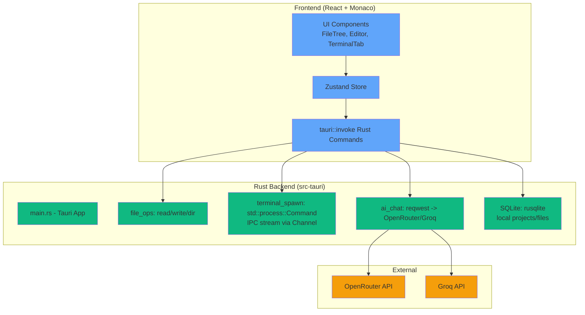

# BYBE IDE → Tauri Desktop Migration Plan

## Current Project Structure (Summary)
```
d:/TOSOL 1/BYBE/
├── client/ (React + Vite + Monaco + shadcn/ui)
│   ├── src/
│   │   ├── components/ (TopBar, CodeEditor, TerminalTab, FileTree, etc.)
│   │   ├── lib/ (store.ts, TerminalSocket.ts, api.ts)
│   │   ├── pages/ (IDEPage.tsx)
│   │   └── hooks/, ui/
├── server/ (Node.js + Express + Socket.IO + Drizzle PG)
│   ├── routes/, services/ (websocket.ts, ai providers)
│   ├── providers/ (openai, groq, etc.)
│   └── db.ts, schema.ts
├── shared/schema.ts
├── package.json, vite.config.ts, tailwind.config.ts
└── No Rust/Tauri yet
```

## Proposed Tauri Structure
```
BYBE/
├── src/ (Frontend React - migrated from client/src)
│   ├── components/ (same, Monaco Editor)
│   ├── lib/ (zustand store, IPC hooks for Rust invoke)
│   ├── App.tsx, main.tsx
├── src-tauri/ (Rust Backend)
│   ├── src/
│   │   ├── main.rs (Tauri window setup)
│   │   ├── lib.rs (commands: file_ops, terminal_spawn, ai_chat)
│   │   ├── models/ (file_tree.rs, terminal.rs, ai.rs, db.rs)
│   ├── tauri.conf.json
│   ├── Cargo.toml (dependencies: tauri, serde, reqwest, rusqlite, tokio)
│   └── build.rs
├── public/ (assets, favicon)
├── Cargo.lock
├── package.json (frontend deps only, tauri addons)
├── tailwind.config.js
└── README.md (build instructions)
```

## Architecture Diagram


## Migration Steps (Detailed Checklist)
1. **Prerequisites**
   - Rust stable-msvc install (`rustup-init.exe`)
   - Visual Studio Build Tools 2022 (C++ workload)
   - Node.js/npm (frontend only)
   - `npm install -g @tauri-apps/cli`

2. **Scaffold Tauri**
   - `cargo tauri init --app-name bybe-ide`
   - Move client/src → src/
   - Update vite.config.ts for Tauri bundler
   - Add Cargo.toml deps: tauri, serde, tokio, reqwest, rusqlite, uuid

3. **Frontend Migration**
   - Replace fetch/api.ts → tauri::invoke('file_read', etc.)
   - Socket.IO → tauri event emit/listen for terminal stream
   - Monaco Editor: keep as-is (webview supports)
   - Zustand store: add tauri state sync

4. **Rust Backend Commands**
   - `#[tauri::command] fn read_file(path: String) -> Result<String>`
   - Terminal: spawn Command, stream stdout via tauri::async_runtime::channel
   - AI: async reqwest POST to OpenRouter/Groq
   - DB: rusqlite for local SQLite (projects, files, settings)

5. **Plugins**
   - `cargo tauri add sqlite` (or manual rusqlite)
   - `cargo tauri add shell` (terminal)

6. **Cleanup**
   - server/ → old-server/ (backup)
   - Remove vite dev server, Node deps from root package.json

7. **Build/Test**
   - `cargo tauri dev` (hot reload)
   - `cargo tauri build` (exe/msi)

## Pros/Cons
**Pros:**
- Native desktop perf (no browser overhead)
- Offline-first (local SQLite)
- Smaller bundle (~50MB vs web 200MB+)
- Rust safety for file/terminal ops
- Cross-platform (Win/Mac/Linux)

**Cons/Risks:**
- Rust learning curve (async IPC)
- Monaco in webview (resize perf)
- Terminal streaming latency (mitigate with channels)
- AI API keys local storage security

**Timeline:** 2-3 days (with Rust ready)

Next: Rust install confirm → scaffold.